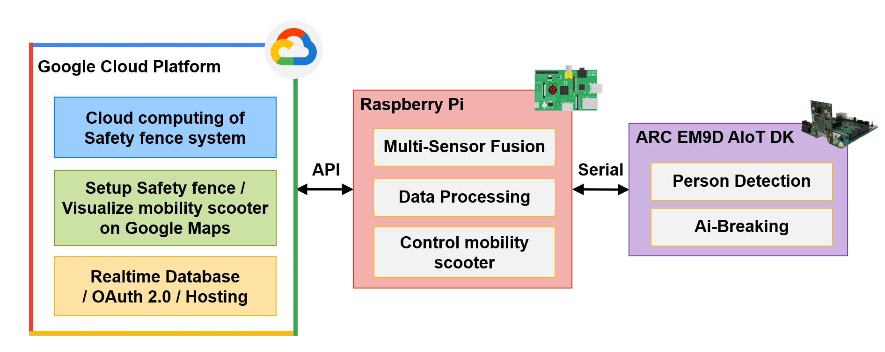
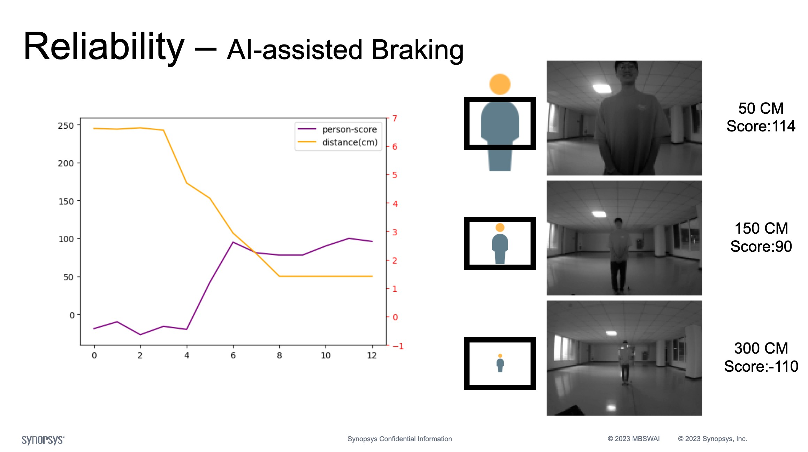
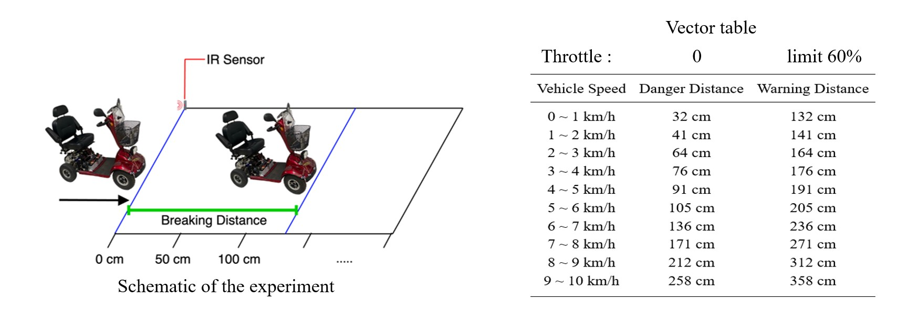
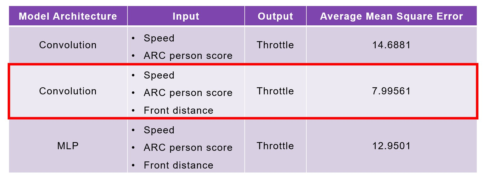
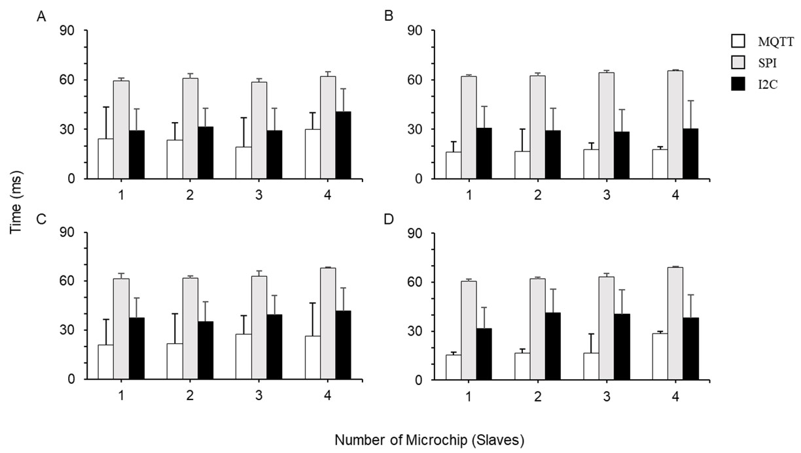

# **[2023 Synopsys ARC AIoT Design Contest](https://contest.synopsys.com.tw/2023ARC)**

# <font color="#4E2683">Team Info</font>

### **智能GCP輔助煞車系統對於醫療代步車之應用 - Application of GCP-assisted braking system with medical mobility scooters**
### Demo Video: https://youtu.be/V3jl4F_nroU
### Team: MBSWAI
### Advisor: 張永華 教授
### Members: 曾石瑋宸、陳彥儒
### Introduction:
Hi, we are students majoring in Electrical Engineering and studying at Chang Gung University. ML, AI, and assistive devices are the research topic of our Lab. 
However, the beginning of the medical mobility scooter started from a grandpa of our best friends. On a regular daily ride, an unfortunate accident happened; fortunately, no serious problem after discharge from the hospital. After the accident, we started to discuss a mobility scooter with Artificial Intelligence to ensure the user's safety. And finally, we have such an idea in this competition.




# <font color="#4E2683">Outline</font>
### [User_Manual](#User_Manual)
### [1. ARC_EM9D](#ARC_EM9D)
### [2. Ai-Breaking_Model_developing](#Ai-Breaking_Model_developing)
### [3. Google_Cloud_Platform_Service](#Google_Cloud_Platform_Service)
### [4. Raspberry_Pi_Multi_Sensor](#Raspberry_Pi_Multi_Sensor)


# User_Manual 

1. Login to the user dashboard with the website.
2. Press turn-on button to turn on the mobility scooter.
3. The mobility scooter system will be automatically turn-on with the turn-on procedure.
4. Mobility Scooter turned-on and enjoy the safe ride.

# ARC_EM9D

### <font color="#4E2683">【Summary】</font>
The code in this folder is the code that runs on the ARC EM9D Tookit, which is responsible for person detect and Ai-Breaking.
```diff
├── ARC_EM9D
 ## └── src (The Ai-Breaking files for ARC EM9D.)
 ## └── inc (The Ai-Breaking files for ARC EM9D.)
```

### <font color="#4E2683">【Protocol】</font>
We use the Serial communication interface UART_0 as the data 
```C
// Initial funtion of uart0
extern DEV_UART * uart0_ptr;
extern char uart_buf[uart_buf_size];
// Sending data
uart0_ptr->uart_write(uart_buf, strlen(uart_buf));
// Receiving data
function_ret = uart0_ptr->uart_read_nonblock(&char_buf, 1);
```

### <font color="#4E2683">【Tensorflow Lite Model】</font>
In order to increase the efficiency of the AI work, we run two TFLite models on the ARC EM9D Tookit at the same time.
* Preson detect TFLite model
* Ai-Breaking TFLite model
```C
// Initial camera image size
uint32_t img_width = 640;
uint32_t img_height = 480;
// Initial two TFLite model for ARC EM9D
model = ::tflite::GetModel(person_detect_model_int8_tflite);
model_2 = ::tflite::GetModel(conv_dense5_new_tflite);
// OP resolver for Preson detect TFLite model
AddAveragePool2D();
AddConv2D();
AddDepthwiseConv2D();
AddReshape();
AddSoftmax();
// OP resolver for Ai breaking TFLite model
AddConv2D();
AddMaxPool2D();
AddFullyConnected();
AddReshape();
// Inference Preson detect and Ai-Breaking TFLite model
int32_t test_result = tflitemicro_algo_run(&test_img[0])
int32_t test_result_d = tflitemicro_algo_run_d(&test_danger);
```


# Ai-Breaking_Model_developing

### <font color="#4E2683">【Summary】</font>
The code in this folder have three different type of Ai-Breaking model, which are including MLP and Convolution Neural Network (CNN). 
```diff
├── Ai_Breaking_Model_develop
 ## └── Conv_Deploy_on_ARC
 ####└── data (The folder includes the process of training and building a three input CNN model.)
 ####└── src (The code files for ARC EM9D.)
 ####└── inc (The code files for ARC EM9D.)
 ## └── Conv_i2_Deploy_on_ARC
 ####└── data (The folder includes the process of training and building a two input CNN model.)
 ####└── src (The code files for ARC EM9D.)
 ####└── inc (The code files for ARC EM9D.)
 ## └── MLP_Deploy_on_ARC
 ####└── data (The folder includes the process of training and building a three input MLP model.)
 ####└── src (The code files for ARC EM9D.)
 ####└── inc (The code files for ARC EM9D.) 
 ## └──  Training & Evaluate(Jupyter Notebook file of all model)
```

### <font color="#4E2683">【Testing the person detect TFLite model】</font>
We use example project of ARC EM9D SDK to test the person detect TFLite model. 

In our testing result, the camera is positioned at the front of the mobility scooter, the detection area will differ from the distance between the camera. On the other way, we can know the distance between the camera and the person by the detection area. 



### <font color="#4E2683">【Data preprocessing】</font>
We utilize the data provided in the schematic of the experiment to determine the vector table. Subsequently, we preprocess the training throttle data of the Ai-Breaking model using the aforementioned vector table.



### <font color="#4E2683">【Training Ai-Breaking model】</font>
We use ```model.history``` to monitor the training process of the Ai-Breaking model. The following is the training result of the MLP model and the CNN model. The training result of the CNN model is better than the MLP model. Therefore, we use the CNN model as the Ai-Breaking model.

```python
import matplotlib.pyplot as plt
pd.DataFrame(hisory.history).plot(figsize=(8, 5))
plt.grid(True)
plt.show()
```

### <font color="#4E2683">【Choose the best Ai-Breaking model】</font>
The following is the evaluation result of the MLP model and the CNN model. The evaluation result of the CNN model is better than the MLP model. Therefore, we use the CNN model as the Ai-Breaking model.



# Google_Cloud_Platform_Service

### <font color="#4E2683">【Summary】</font>
The code in this folder is the code that runs on the Google Cloud Platform service, which is responsible for the ongoing cloud computing process on GCP virtual machine and the Web Base Platform which is hosting at GCP firebase.


### <font color="#4E2683">【Compute engine】</font>
We use the Compute engine to run the ongoing cloud computing process. The ongoing cloud computing process is responsible for the following tasks:
* Line Notify service (including authentication token and sending the notification.)
* Safety Fence service (including the detection area and the distance between the mobility scooter and each Safety Fence.)
* Full access to manage the database of the Web Base Platform.


### <font color="#4E2683">【Google Maps Platform】</font>
In order to visualize the Safety Fence service on the map, we use the Google Maps Platform service.

* Google Maps Places API

    In order to improve the convenience of using the Safety Fence service, we use the Places API of the Google Maps Platform, so that users can quickly search for locations on the map and add the searched locations to the Safety Fence.


```javascript
google.maps.places.Autocomplete()
```

* Google Maps Router API

    If the cloud computing result indicates that the vehicle is outside the Safety Fence, the service will immediately to retrieve detailed navigation information from the user's location to the vehicle's location. This allows family members to quickly see how to reach the mobility vehicle's location.

```javascript
DirectionsService.route()
directionsRenderer() 
```

* Google Maps Data API

    In order to allow family members to intuitively view the driving trajectory of the mobility scooter, we use the Data API to visualize the driving trajectory of the mobility scooter on the map.

```javascript
google.maps.Data()
obj.addGeoJson(data);
obj.setMap(map);
```

### <font color="#4E2683">【Firebase】</font>

* Realtime Database

    In order to achieve the goal of security, real-time, and low-latency remote monitoring by family members, we use the Realtime Database service of Firebase to store the data of the Web Base Platform.


```javascript
firebase.database().ref().on()
```


* OAuth 2.0

    In order to allow the Web Base Platform to have exclusive personalized functions and ensure the security of access to the cloud database. Therefore, we use the OAuth 2.0 service provided by Google. Users can log in through a Google account and authorize the Web Base Platform to access the user's personal information, such as the user's email address, the user's photo, the user's emergency contact phone number, etc.

```javascript
firebase.auth().signInWithPopup(providerGoogle)
firebase.auth().onAuthStateChanged(user.uid)
```

* Hosting

    It provides us a place to host the Web Base Platform stably.

### <font color="#4E2683">【Demo】</font>
* Web-base Dashboard Link: https://cgu-project-autobrake.firebaseapp.com
* OAuth 2.0 & User Interface: https://youtu.be/YjRofPHkwWA
* Safety Fence & Google Maps Platform: https://youtu.be/UjUntM-rHgA
* Overview Dashboard: https://youtu.be/LlMl_cz8Q9E


# Raspberry_Pi_Multi_Sensor

### <font color="#4E2683">【Summary】</font>
The code in this folder is the code that runs on the Raspberry Pi, which is responsible for integrate multi-sensor and raw data processing center.

### <font color="#4E2683">【Protocol Testing and Comparation】</font>

It is better to use MQTT as a transmission protocol for sending data between MCUs and SBC, having a shorter transmission time with high accuracy. 




### <font color="#4E2683">【MQTT】</font>

For smart mobility scooters, the most important thing is to be able to collect vehicle data and perform control operations. Due to the above experimental results, MQTT is a stable and fast communication protocol. Therefore, we choose to use MQTT as the vehicle data transmission protocol and establish an MQTT broker on the Raspberry Pi. And establish an MQTT client on the ESP-01 to achieve the transmission of vehicle data.

We have seven MQTT topics, which are including the following topics:
* Motor Module
* Speed Module
* Power-on Module
* Turning Sensing Module
* Front Distance Module
* Rear Distance Sensing Module
* Temperature and Voltage Sensing Module


```python
# MQTT broker
MQTT.client.loop_forever()
MQTT.client.disconnect()

# MQTT client
MQTT.sendRequest()
```


### <font color="#4E2683">【Serial】</font>

In order to allow Raspberry Pi and ARC EM9D to transmit data, we use the Serial communication protocol and establish a Serial port on the Raspberry Pi and a UART_0 port on the ARC EM9D. Transmit data through UART_0 port and Serial port.


```python
subprocess.getoutput('ls /dev/ttyUSB*')
serial.Serial (osreply, 115200, timeout=1)

ser.write(toBytes('S' + str(data.speed().getspeed()) + "%"))
ser.write(toBytes('D' + str(data.distance().getFrontDistance()) + "%"))
```